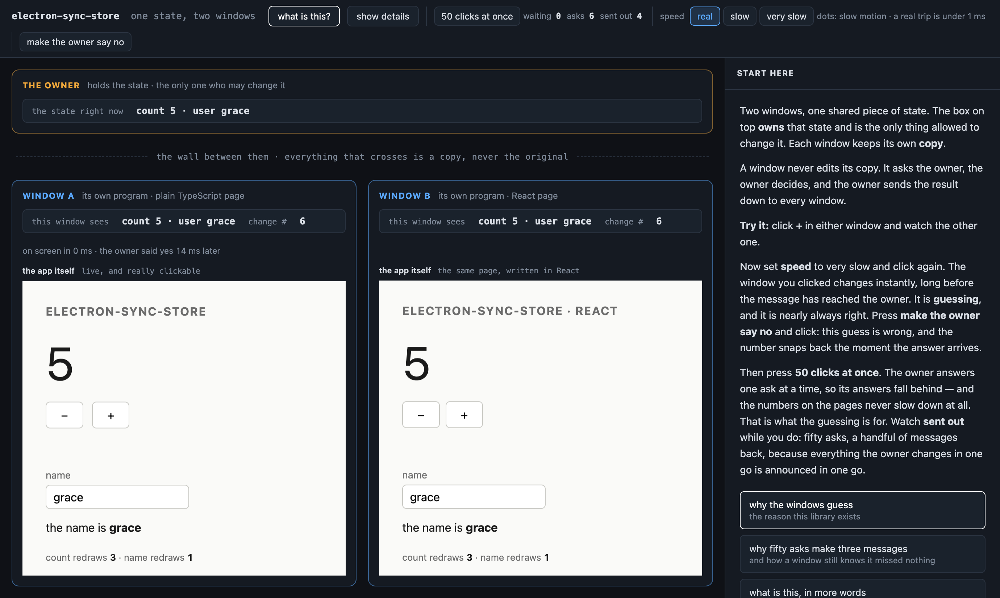
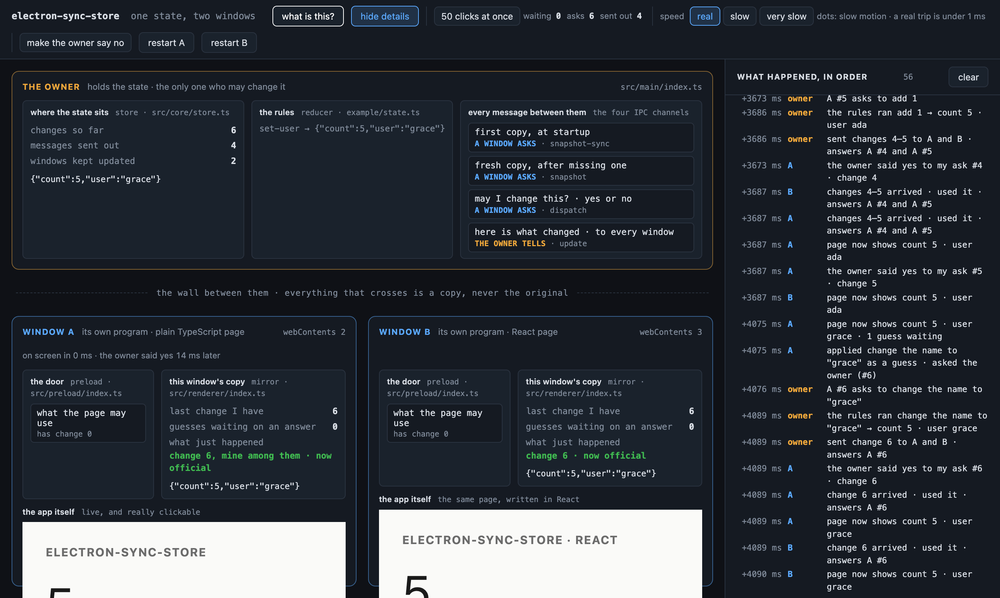

# electron-sync-store

[](https://github.com/kadenpriebe/electron-sync-store/actions/workflows/ci.yml)

Shared state across Electron's processes, where **reads are synchronous from
the first line of application code** and **writes apply immediately and are
reconciled against the main process afterwards**.

```ts
const store = createRendererStore(reducer);

store.getState();              // already populated, on line one, with no await
store.dispatch({ type: "inc" }); // the page has already changed
```

[`@zubridge/electron`](https://github.com/goosewobbler/zubridge) is the mature
option in this space and handles deltas, sequencing, batching and selective
subscriptions well. This is a narrower library that does three things it does
not: the store is populated **before the first line of page code runs**, the
compiler **refuses state that cannot survive the crossing**, and writes are
**optimistic, with reconciliation and rollback**.

---

## The demo is the documentation

`npm start` opens one window that is a live diagram of the library, with two
real renderer processes embedded inside it. Every box maps to a file in `src/`,
every dot that moves is an IPC message that actually happened, and the event
log is the library's own trace hook. Click any box and it explains itself.



Window A is a plain TypeScript page; window B is the same page in React. Same
library, same preload, same state. Press **show details** and the diagram opens
up into every file and handler, with a live event log:



Three things to try:

- Set speed to **very slow** and click `+`. The window you clicked changes
  instantly, long before the message reaches main. That is the guess.
- Press **make the owner say no**, then click. The guess was wrong, and the
  number snaps back the moment the answer arrives.
- Press **50 clicks at once** and watch `asks` against `sent out`. Fifty asks;
  three messages back.

---

## Install

```sh
npm install electron-sync-store
```

Electron is a peer dependency. React is an optional one, needed only for
`electron-sync-store/react`.

## Use

**Main** — create the store during startup, before any window exists. The
bootstrap handler must be listening before a preload can block on it.

```ts
import { createMainStore } from "electron-sync-store/main";

app.whenReady().then(() => {
  createMainStore(reducer, { count: 0, user: "ada" });
  new BrowserWindow({ webPreferences: { preload } });
});
```

**Preload** — importing the module is the whole installation.

```ts
import "electron-sync-store/preload";
```

**Renderer** — no `await`, and no loading state.

```ts
import { createRendererStore } from "electron-sync-store/renderer";

const store = createRendererStore(reducer);

render(store.getState());                       // already there
store.subscribe(render);                        // the whole state
store.subscribe((s) => s.count, drawCount);     // or one slice of it

const result = await store.dispatch({ type: "inc" });
if (result.status === "rejected") console.warn(result.reason);
```

**React**

```tsx
import { useDispatch, useStore } from "electron-sync-store/react";

const selectCount = (state: State) => state.count;

function Counter() {
  const count = useStore(store, selectCount);
  const dispatch = useDispatch(store);
  return <button onClick={() => dispatch({ type: "inc" })}>{count}</button>;
}
```

---

## How it works

Main owns the state and is the only writer. Renderers never mutate anything;
they *propose* actions and main decides. That is what gives every change a
total order for free — arrival order at a single owner **is** the order of
truth, with no clocks to skew and no conflicts to resolve.

Every renderer keeps a full local mirror, which is what makes reads
synchronous: `getState()` returns a value already in that process's memory and
never touches IPC. Writes take a lap through main.

```
  main            createMainStore   the only writer, numbers every change
   |
   |  snapshot-sync   one blocking call, per window, before the page exists
   |  snapshot        a full copy for a mirror that missed something
   |  dispatch        a proposal, answered yes or no to the proposer alone
   |  update          every change, to every subscribed renderer
   |
  ===== process boundary: everything crossing is a structured clone =====
   |
  preload         createBridge      the only code that sees both sides
   |
  renderer        createRendererStore
                    confirmed  what main last said
                  + pending    this window's unanswered guesses
                  = visible    what the page reads
```

## Design decisions

### One blocking call, on purpose

The preload makes exactly one `ipcRenderer.sendSync` at bootstrap. Electron's
own documentation calls `sendSync` a "last resort" and recommends avoiding it,
because it blocks the renderer until main replies.

That reasoning does not apply here, and the deviation is deliberate. This runs
in the preload, before the page's own JavaScript and before anything has
painted: there is no UI to freeze and no user to make wait. It happens once per
window and costs one IPC hop. What it buys is that `getState()` works on the
first line of application code, so no consumer needs a loading state that
exists only because of how the library boots.

The failure mode is sharp and worth knowing: if no handler is listening, the
renderer **hangs indefinitely** — not a throw, not `undefined`. `createMainStore`
must therefore be called during startup, before any window is created.

### Writes are guesses, and the guess is nearly always right

Main is single threaded, so it answers one proposal at a time. A window that
waits for its answer feels slow exactly when the app is busiest.

So the mirror applies the action locally at once and sends it. Two states live
in each renderer: `confirmed`, which only main can move, and `pending`, the
list of proposals this window has not heard back about. What the page sees is
`confirmed` with `pending` replayed on top, through the same reducer main runs.

- Main confirms: the guess leaves the list, and what the page already showed
  was right.
- Main rejects (its reducer threw): the guess leaves the list and the replay
  simply no longer includes it. That is the rollback, and it costs nothing to
  keep track of.
- Another window's change arrives: it lands underneath, and the guesses are
  replayed on top of the new truth — a rebase.

The prior art is **TanStack Query's** mutation lifecycle
(`onMutate` / `onError` / `onSettled`), not React 19's `useOptimistic`, which is
defined in terms of a React value and cannot be driven by a store that lives
outside React.

`dispatch()` returns a promise that never rejects. A refusal by main and a
failure of the transport both arrive as `{ status: "rejected", reason }`, so
fire-and-forget callers can ignore it safely.

### The compiler refuses state that cannot cross

Everything that crosses is copied by V8's structured clone algorithm. Functions,
symbols and promises throw on the way. Worse, class instances arrive as plain
objects holding only their data — prototype gone, methods gone, no error and no
warning.

`Serializable<T>` maps anything clone cannot carry to `never`, so the offending
property stops being assignable and the compiler names it:

```
Argument of type 'AppState' is not assignable to parameter of type
'AppState & { count: number; bump: never; }'
  Types of property 'bump' are incompatible.
    Type '() => void' is not assignable to type 'never'.
```

Claimed narrowly, because the limits matter:

- It **does** catch class instances with methods, which is the harmful case —
  `keyof` a class includes its methods.
- It **cannot** catch a method-less class instance. TypeScript has no way to
  tell one from a plain object with the same fields
  ([TypeScript#29063](https://github.com/microsoft/TypeScript/issues/29063)),
  and such an instance loses only its prototype identity.
- The general type is not novel: `type-fest` ships `StructuredCloneable`.
  Applying it to an Electron state boundary is what is being done here.
- Very deep state trees can hit `TS2589`, and rejection errors are the usual
  wall of expanded unions.

Every `@ts-expect-error` in `test/serializable.test.ts` is an assertion: remove
one and `npm run typecheck` fails.

### Who gets woken up, and when

A watcher may take a selector, and is told only when that slice changes by
`Object.is`. Watching the whole state is the same mechanism with the identity
selector.

A dispatch does not call listeners; it schedules one flush. Everything in the
same batch coalesces to one notification holding the final state — in a
renderer, one re-render instead of ten; in main, one IPC broadcast instead of
ten.

**When that flush happens is the store's to choose, and the two processes choose
differently.** A renderer flushes on a **microtask**, so everything queued in
one tick coalesces and the flush still lands before the browser can paint. Main
does not: fifty proposals arrive as fifty separate IPC callbacks, each its own
task, so a microtask flush would run between every one of them and batch
nothing at all. Main flushes on **`setImmediate`**, which fires after the
pending I/O callbacks have been drained — the first moment at which
"everything that arrived together" has finished arriving. Measured on the demo,
that is the difference between 54 broadcasts and 3.

This is parity with what other libraries in this space already do, not
innovation. Zubridge ships selective subscriptions and a batcher of its own.

### Knowing you are current

Every change gets a number. Every broadcast says which changes it covers:

```ts
type Update<S> = { state: S; seq: number; since: number; origins?: Origin[] };
```

An update covers `(since, seq]`. A mirror holding exactly `since` applies it; a
mirror holding anything else knows something never reached it and asks for a
full copy instead. A single change has `since === seq - 1`, so one change and a
batch of fifty are the same test with nothing special-cased. Without `since`, a
batch jumping from 7 to 12 would be indistinguishable from four lost messages.

`origins` names every proposal an update answers, because one message can
answer several, from more than one window.

The ordering guarantee underneath comes from **Mojo**, Chromium's IPC layer,
which preserves order within a message pipe. Electron does not document IPC
ordering itself, so it should not be cited for it. And ordering is not the same
as delivery: messages sent to a renderer that is reloading or navigating are
genuinely lost, because the reload destroys the JavaScript context and every
listener with it ([electron#8892](https://github.com/electron/electron/issues/8892)).
Gap detection is what catches that, and restarting a window in the demo shows
it happening.

### A seam where the transport should be

The bridge is an interface, not a hard dependency on `ipcRenderer`:

```ts
interface SyncStoreBridge {
  readonly initialState: unknown;
  snapshot(): Promise<unknown>;
  dispatch(envelope: unknown): Promise<unknown>;
  onUpdate(callback: (update: unknown) => void): () => void;
}
```

That seam is why the tests exist at all. `test/sync.test.ts` holds both ends of
the wire and can drop a message, reorder one, or refuse to answer — none of
which is reachable through a real IPC channel. It is also how the example adds
adjustable latency without the library knowing.

Both stores also take an optional `trace` callback, called at every point where
the library makes a decision. The tests assert on those events, and the demo
draws them. Same hook.

---

## What was deliberately not built

| Not built | Why not |
|---|---|
| Deltas instead of whole snapshots | Only matters at large state size, and the sequence numbers already lay the groundwork. A clean future step, not a gap. |
| Partial mirrors | Genuinely hard — a read of an unsubscribed slice has no good answer. Wrong complexity for this size of state. |
| Persistence to disk | A different problem with mature solutions. |
| Time-travel debugging | Large surface, unrelated to the thesis. |
| Rejecting stale writes (seq-stamped proposals) | Borderline, and cheap. The obvious next improvement if one more were wanted. |

## What the tests do not cover

Two layers, and the seam between them is worth naming.

`npm test` is 38 tests across five files, all against the in-memory bridge.
That is the right seam for the store's logic and the wrong one for everything
Electron owns, so those tests say nothing about the blocking bootstrap, a
window reloading and re-bootstrapping, or a broadcast reaching two real
renderer processes exactly once each.

`npm run verify` covers that. It boots the real demo and drives it from
outside, asserting on what actually happens in three processes:

```
  PASS  a click in A reaches B                              [A 1 B 1]
  PASS  at 1.5 s A shows the guess and B has not heard      [A 2 B 1]
  PASS  a refused click rolls back and says why             [rolled back: ...]
  PASS  typing a name redraws neither count                 [A 2->2 B 4->4]
  PASS  50 clicks at once are all answered                  [asks 50]
  PASS  in far fewer messages than asks                     [sent out 1]
  PASS  a restarted window re-bootstraps and keeps up       [A 53 B 53]
  PASS  the next change reached each window exactly once    [2 arrivals]
  PASS  no window ever reported a missing message
```

It needs a display, so CI does not run it, and CI does not pretend to.

One ordering edge is documented and left alone: a lost broadcast whose reply
arrives *after* the resync snapshot shows a guess twice until the reply lands.
It is unreachable over real FIFO IPC, where the reply precedes the broadcast
that exposes the gap, and reachable only through a deliberately reordering
bridge.

## Scripts

```sh
npm start        # build, then open the demo
npm test         # vitest, 38 tests, no display needed
npm run verify   # drive the real demo and assert on it, 16 checks
npm run typecheck
npm run build
npm run screenshots   # regenerate the two pictures above from a real run
```

`src/core/store.ts` has no Electron import in it, and that is enforced by the
fact that the tests run in a plain Node process with no display.

## License

MIT
